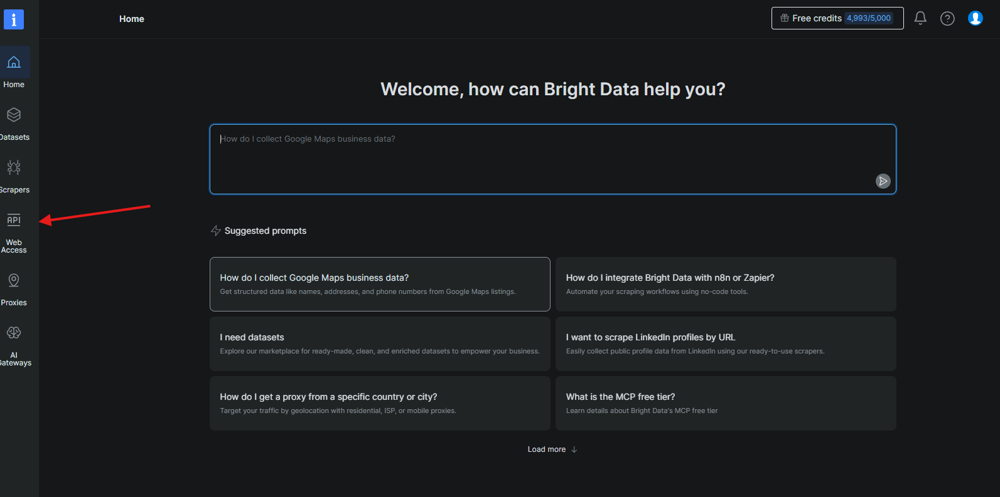
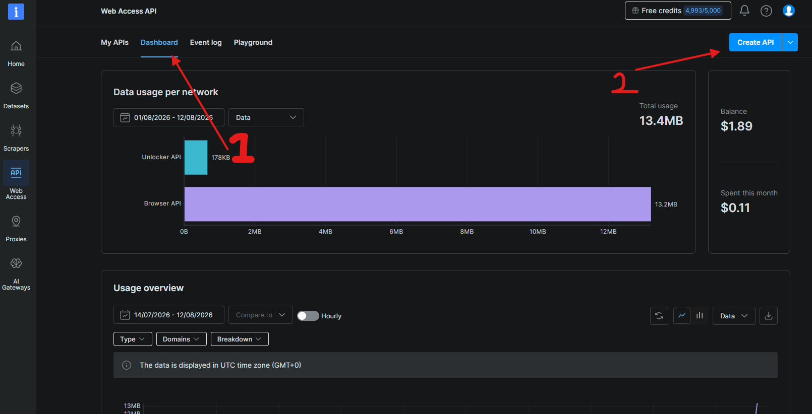
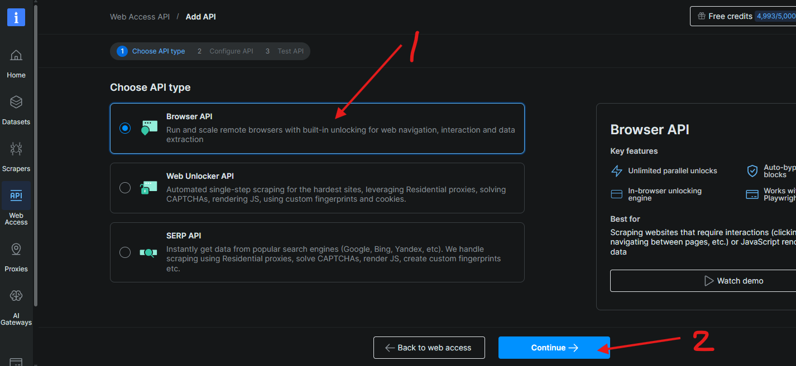
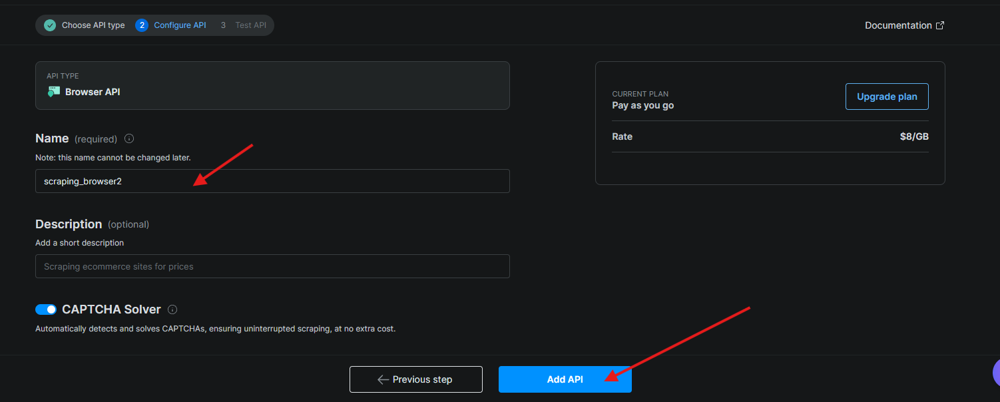
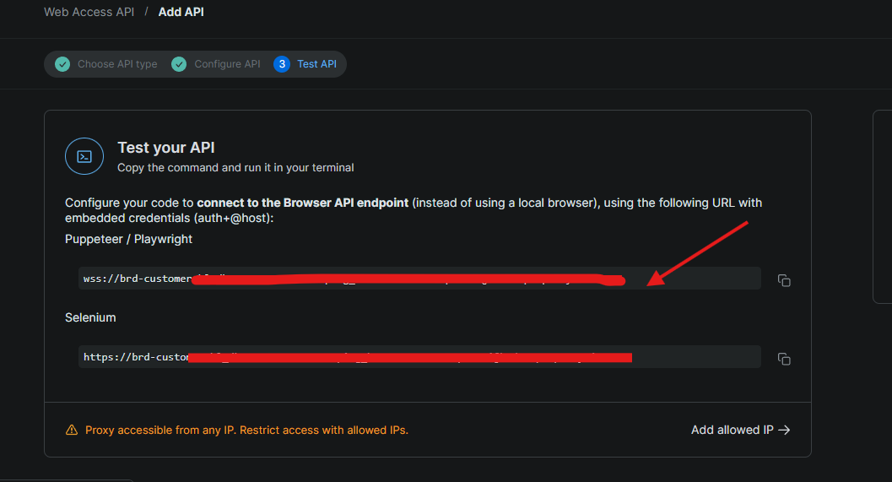

# FitYoink

No more clicking each FitGirl repack link separately. Paste the game page URL once, pick your download host, and FitYoink fetches and downloads everything automatically.

Supports: **fuckingfast.co**, **datanodes.to**, **pixeldrain**, **gofile**, **1fichier**, **buzzheavier**, **mediafire**

---

## Download

**[⬇ FitYoink-v2.0.0-win-x64.zip](https://github.com/Ttecs/fityoink/releases/latest)**

Windows x64 only. No install needed — just extract and run.

> **💡 First run tip:** Windows might say "unrecognized app" — just click **More info → Run anyway**. This happens to all unsigned indie apps. Source code is right here on GitHub if you want to check it.

---

## How to run

1. Download the zip from the link above
2. Extract it anywhere (e.g. your Desktop)
3. Open the `FitYoink` folder
4. Double-click **FitYoink.exe**

> If Windows shows a SmartScreen warning, click **More info → Run anyway**. This happens because the exe isn't code-signed.

---

## How to use

### fuckingfast.co links (no setup needed)

1. Go to a FitGirl game page, e.g. `https://fitgirl-repacks.site/game-name/`
2. Copy the URL
3. Paste it into FitYoink, make sure **⚡ fuckingfast.co** is selected
4. Click **Fetch Links**
5. Select the files you want (all checked by default)
6. Click **⬇ Download Selected**

### datanodes.to links (requires Bright Data)

1. Paste the game page URL
2. Select **🗄 datanodes.to**
3. If Bright Data isn't set up yet, the app will show a step-by-step guide inside — follow it
4. Once your WSS URL is saved in Settings, click **Fetch Links** and download normally

### Controls per download

| Button | What it does |
|--------|-------------|
| **Pause** | Stops the download cleanly |
| **Resume** | Picks up where it left off (HTTP range resume) |
| **Cancel** | Stops and deletes the partial file |
| **Open Folder** | Opens the download folder when done |

---

## Bright Data setup (for datanodes.to)

datanodes.to uses Cloudflare Turnstile — Bright Data's Scraping Browser solves it automatically in the cloud. Free tier is enough.

### Step 1 — Create a Bright Data account

Go to [brightdata.com](https://brightdata.com), sign up, and log in. Click **Web Access** in the left sidebar.

---

### Step 2 — Open the Dashboard and create a new API

Click the **Dashboard** tab, then click **Create API** in the top-right corner.

---

### Step 3 — Select Browser API

Select **Browser API** (top option) and click **Continue**.

---

### Step 4 — Name your API and add it

Give it any name (e.g. `scraping_browser1`), make sure **CAPTCHA Solver** is on, then click **Add API**.

---

### Step 5 — Copy your WSS URL

Copy the `wss://...` line shown under **Puppeteer / Playwright**.

---

### Step 6 — Paste it into FitYoink

1. Open FitYoink
2. Click **⚙️** in the top-right
3. Paste the WSS URL into **Bright Data Scraping Browser WSS URL**
4. Click **Save**

---

## Settings

| Setting | Default | Description |
|---------|---------|-------------|
| Download Folder | `~/Downloads/fitgirl` | Where files are saved |
| Bright Data WSS URL | *(empty)* | Required for datanodes.to only |
| Pre-resolve trigger % | 80 | Start resolving the next link when current download hits this % |

---

## Troubleshooting

**Windows SmartScreen blocks the exe**
→ Click "More info" then "Run anyway". Safe to ignore — no code signing certificate.

**"Could not resolve link" on datanodes**
→ Check your Bright Data WSS URL in Settings. Make sure the zone is active on the Bright Data dashboard.

**Download stuck at 0%**
→ The CDN link may have expired. Cancel and re-fetch.

**fuckingfast links not found**
→ Make sure you pasted the FitGirl game page URL (`fitgirl-repacks.site/...`), not a datanodes or paste URL.

---

## Support

If FitYoink saved you some time, a coffee keeps it going ☕

---

## License

Non-commercial use only. See [LICENSE](LICENSE).
